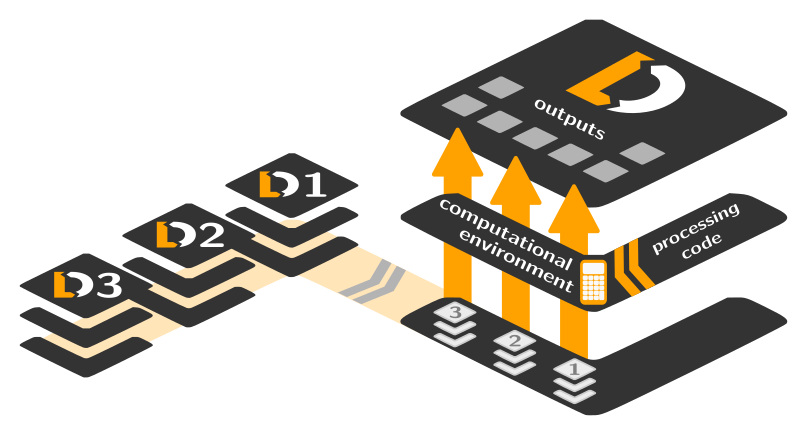
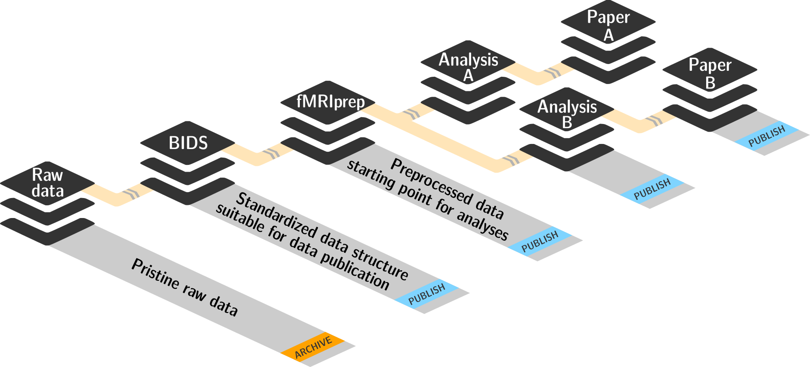

## Introduction

In this lesson, we will carry out a full (although very basic) functional
imaging study, going from raw data to complete data-analysis results.  We will
start from imaging data in DICOM format — as if we had just finished scanning.
Importantly, we will conduct this analysis so that it

- leaves a comprehensive "paper trail" of all performed steps; everything
  will be tracked via version control

- structures components in a way that facilitates reuse

- performs all critical computation in containerized computational environments
  for improved reproducibility and portability

For all steps of this study, we will use [DataLad] to achieve these goals with
relatively minimal effort.

> #### DataLad Extensions
>
> [DataLad] itself is a data management package that is completely agnostic of
> data formats and analysis procedures. However, DataLad functionality can be
> extended via so-called *extension packages* that add additional support for
> particular data formats and workflows. In this lesson, we will make use
> of two extension packages: [datalad-neuroimaging] and [datalad-container].
>
> {:callout}

Our analysis will benefit from a standardization effort that was performed at
the time of data acquisition. The metadata of the input DICOM images already
contain all necessary information to identify the purpose of individual scans
and encode essential properties into the filenames used in a BIDS-compliant
dataset. The following figure illustrates how this critical information can be
encoded into the acquisition protocol names at a scanner console when setting
up a new study, by following the [ReproIn] naming conventions.

## Prepare the Data for Analysis

Before analyzing imaging data, we typically have to convert them from their
original DICOM format into NIfTI files.

The data we are working with already follows the [ReproIn] naming conventions,
and the [HeuDiConv] converter can use this information to automatically create
a BIDS-compliant dataset for us.

We gain a lot here by adopting the [BIDS] standard. Up front, it saves us the
effort of creating an ad-hoc directory structure. But more importantly, by
structuring our data in a standard way (and an increasingly common one), it
opens up possibilities for us to easily feed our dataset into existing analysis
pipelines and tools.

Our first goal is to convert our DICOM data into a DataLad dataset in BIDS
format.

> ## Task: Create a new DataLad dataset called `localizer_scans`
>
> Use the [datalad create] command
>
> > ## Solution
> > ~~~
> > % datalad create localizer_scans
> > ~~~
> > {: .bash}
> {: .solution}
>
{: .challenge}

We now have the new dataset in the `localizer_scans/` directory. We will change
into this directory so that all further commands will be able to use relative
paths.

> ~~~
> % cd localizer_scans
> ~~~
> {: .bash}

> #### Advantages of Relative Path Specification
>
> In many cases, it does not matter whether one uses absolute vs relative paths,
> but when it comes to portability, it has a great impact. Using relative paths
> makes it possible to move a dataset to another folder on your system (or give
> it to a colleague using a different computer) and still have everything
> intra-connected and working as it should.
>
> {:callout}

When using DataLad, it is best to always run scripts from the root directory of
the dataset — and also code all scripts to use paths that are relative to this
root directory. For this to work, a dataset must contain all of the inputs of a
processing step (all code, all data).

That means that we should add the raw DICOM files to our dataset. In our case,
these DICOMs are already available in a DataLad dataset from
[GitHub](https://github.com/datalad/example-dicom-functional.git) that we can
add as a *subdataset* to our `localizer_scans` dataset.

> ## Task: Add DICOM data as a subdataset in `inputs/rawdata`
>
> Use the [datalad install] command. Make sure to identify the `localizer_scans`
> dataset (the current directory) as the dataset to operate on in order to
> register the DICOMs as a subdataset (and not simply downloaded as a standalone
> dataset).  Then, use the [datalad subdatasets] command to verify the result.
>
> > ## Solution
> > ~~~
> > % datalad install --dataset . --source https://github.com/datalad/example-dicom-functional.git inputs/rawdata
> > % datalad subdatasets
> > ~~~
> > {: .bash}
> {: .solution}
>
{: .challenge}

### Working With Containers

Any software you are using (and at any step) has the potential to have
bugs/errors/horrifying-gremlins — and arguably already does, you just may not
know it yet. Hence we take extra care to know *exactly* what software we are
using and that we can go back to it at a later stage, should we have the need to
investigate an issue.

Containerized computational environments are a great way to handle this problem.
DataLad (via its [datalad-container] extension) provides support for using and
managing such environments for data processing. We can add an image of a
computational environment to a DataLad dataset (just like any other) file, so we
know exactly what we are using and where to get it again in the future.

A ready-made [singularity] container with the [HeuDiConv] DICOM converter
(~160 MB) is available from [singularity-hub] at:
shub://mih/ohbm2018-training:heudiconv

> ## Task: Add the HeuDiConv container to the dataset
>
> Use the [datalad containers-add] command to add this container under the name
> `heudiconv`. Then use the [datalad containers-list] command to verify that
> everything worked.
>
> > ## Solution
> > ~~~
> > % datalad containers-add heudiconv --url shub://mih/ohbm2018-training:heudiconv
> > % datalad containers-list
> > ~~~
> > {: .bash}
> {: .solution}
>
{: .challenge}

Our dataset now tracks all input data and the computational environment for the
DICOM conversion. This means that we have a complete record of all components
(thus far) in this one dataset that we can reference via relative paths from the
dataset root. This is a good starting point for conducting a portable analysis.

[datalad run] and [datalad containers-run] \(provided by the [datalad-container]
extension) allow a user to run arbitrary shell commands and capture the output
in a dataset. By design, both commands behave nearly identically. The primary
difference is that [datalad run] executes commands in the local environment,
whereas [datalad containers-run] executes commands inside of a containerized
environment. Here, we will use the latter.

> ## Task: Convert DICOM using HeuDiConv from the container
>
> An appropriate [HeuDiConv] command looks like this:
>
>     heudiconv -f reproin -s 02 -c dcm2niix -b -l "" --minmeta -a . \
>         -o /tmp/heudiconv.sub-02 --files inputs/rawdata/dicoms
>
> It essentially tells it to use the [ReproIn heuristic] to convert the
> DICOMs using the subject identifier `02`, with the DICOM converter
> `dcm2niix`, into the BIDS format. The last argument is the directory
> containing the DICOMs.
>
> Run this command using [datalad containers-run], making sure to include a
> meaningful commit message, so that the results of this command are saved with
> a meaningful context. If anything goes wrong when running the command,
> remember that you can use `git reset --hard` on the dataset repository to
> throw away anything that is not yet committed.
>
> Once done, use the [datalad diff] command to compare the dataset to the
> previous saved state (`HEAD~1`) to get an instant summary of the changes.
>
> > ## Solution
> > It is sufficient to prefix the original command line call with
> > `datalad containers-run -m "<some message>"`.
> > ~~~
> > % datalad containers-run -m "Convert sub-02 DICOMs into BIDS" \
> >       heudiconv -f reproin -s 02 -c dcm2niix -b -l "" --minmeta -a . \
> >       -o /tmp/heudiconv.sub-02 --files inputs/rawdata/dicoms
> > % datalad diff --revision HEAD~1
> > ~~~
> > {: .bash}
> > It is not necessary to specify the name of the container to be used.
> > If there is only one container known to a dataset, [datalad containers-run]
> > is clever enough to use that one.
> {: .solution}
>
{: .challenge}

You can now confirm that a NIfTI file has been added to the dataset and that its
name is compliant with the [BIDS] standard. Information such as the task-label
has been automatically extracted from the imaging sequence description.

There is only one thing missing before we can analyze our functional
imaging data: we need to know what stimulation was done at which point during
the scan. Thankfully, the data was collected using an implementation that
exported this information directly in the [BIDS] `events.tsv` format. The
file came with our DICOM dataset and can be found at
`inputs/rawdata/events.tsv`. All we need to do is copy it to the right location
under the BIDS-mandated name.

We can use `cp` to do this easily, but the copying step itself would not be
entered into the dataset's history and thus the file would be added with no
indication of where it came from. A good commit message can help with that, but
what would be even better is to run `cp` using [datalad run] to capture this
information.

> ## Task: Copy the event.tsv file to its correct location via `run`
>
> BIDS requires that this file be located at `sub-02/func/sub-02_task-oneback_run-01_events.tsv`.
> Use the [datalad run] command to execute the `cp` command to implement this
> step. This time, however, use the options `--input` and
> `--output` to inform [datalad run] what files need to be available
> and what locations need to be writeable for this command.
>
> In order to avoid duplication, [datalad run] supports placeholder labels
> that you can use in the command specification itself.
>
> Use `git log` to investigate what information [DataLad] captured about this
> command's execution.
>
> > ## Solution
> > Prefix the original command line call with 
> > `datalad run -m "<some message>" --input <input file> --output <output file>` and 
> > replace those files in the original command by `{inputs}` and `{outputs}` respectively.
> > 
> > ~~~
> > % datalad run -m "Import stimulation events" \
> >       --input inputs/rawdata/events.tsv \
> >       --output sub-02/func/sub-02_task-oneback_run-01_events.tsv \
> >       cp {inputs} {outputs}
> > % git log -p
> > ~~~
> > {: .bash}
> > 
> {: .solution}
>
{: .challenge}

We are now done with the data preparation. We have the skeleton of a
BIDS-compliant dataset that contains all data in the right format and using the
correct file names. In addition, the computational environment used to perform
the DICOM conversion is tracked, as well as a separate dataset with the input
DICOM data. This means we can trace every single file in this dataset back to
its origin, including the commands and inputs used to create it.

This dataset is now ready. It can be archived and used as input for one or more
analyses of any kind. Let's leave the dataset directory now:

> ~~~
> % cd ..
> ~~~
> {: .bash}

## A Reproducible GLM Demo Analysis

With our raw data prepared in BIDS format, we can now conduct an analysis.
We will implement a very basic first-level GLM analysis using FSL that runs
in just a few minutes. We will follow the same principles that we already
applied when we prepared the `localizer_scans` dataset: the complete capture of
all inputs, computational environments, code, and outputs.

Importantly, we will conduct our analysis in a new dataset. The raw
`localizer_scans` dataset is suitable for many different analysis that can all
use that dataset as input. In order to avoid wasteful duplication and to improve
the modularity of our data structures, we will merely use the `localizer_scans`
dataset as an input, but we will *not* modify it in any way.

> ## Task: Create a new DataLad dataset called `glm_analysis`
>
> Use the [datalad create] command. Then change into the root directory of the
> newly created dataset.
>
> > ## Solution
> > ~~~
> > % datalad create glm_analysis
> > % cd glm_analysis
> > ~~~
> > {: .bash}
> {: .solution}
>
{: .challenge}

Following the same logic and commands as before, we will add the
`localizer_scans` dataset as a subdataset of the new `glm_analysis` dataset to
enable comprehensive tracking of all input data within the analysis dataset.

> ## Task: Add `localizer_scans` data as a subdataset in `inputs/rawdata`
>
> Use the [datalad install] command. Make sure to identify the analysis dataset
> (the current directory) as the dataset to operate on in order to register the
> `localizer_scans` dataset as a subdataset (and not just as a standalone
> dataset). Then, use the [datalad subdatasets] command to verify the result.
>
> > ## Solution
> > ~~~
> > % datalad install --dataset . --source ../localizer_scans inputs/rawdata
> > % datalad subdatasets
> > ~~~
> > {: .bash}
> {: .solution}
>
{: .challenge}

Regarding the layout of this analysis dataset, we unfortunately cannot yet rely
on automatic tools and a comprehensive standard (but such guidelines are
actively being worked on). However, DataLad nevertheless aids efforts to bring
order to the chaos. Anyone can develop their own ideas on how a dataset should
be structured and implement these concepts in *dataset procedures* that can be
executed using the [datalad run-procedure] command.

Here we are going to adopt the YODA principles: a set of simple rules on how to
structure analysis dataset. You can learn more about YODA at OHBM poster 2046
(*YODA: YODA’s organigram on data analysis*). But here, the only relevant aspect
is that we want to keep all analysis scripts in the `code/` subdirectory of
this dataset. We can get a readily configured dataset by running the YODA
setup procedure:

> ## Task: Run the `setup_yoda_dataset` procedure
>
> Use the [datalad run-procedure] command. Check what has changed in the dataset.
>
> > ## Solution
> > ~~~
> > % datalad run-procedure setup_yoda_dataset
> > ~~~
> > {: .bash}
> {: .solution}
>
{: .challenge}

Before we can fire up FSL for our GLM analysis, we need two pieces of custom
code:

1. a small script that can convert BIDS events.tsv files into the EV3 format that
   FSL can understand, available at <https://raw.githubusercontent.com/myyoda/ohbm2018-training/master/section23/scripts/events2ev3.sh>

2. an FSL analysis configuration template script available at <https://raw.githubusercontent.com/myyoda/ohbm2018-training/master/section23/scripts/ffa_design.fsf>

Any custom code needs to be tracked if we want to achieve a complete record of
how an analysis was conducted. Hence we will store those scripts in our analysis
dataset.

> ## Download the Scripts and Include Them in the Analysis Dataset
>
> Use the [datalad download-url] command. Place the scripts in the `code/` directory
> under their respective names. Check `git log` to confirm that the commit message
> shows the URL where each script has been downloaded from.
>
> > ## Solution
> > ~~~
> > % datalad download-url --path code \
> >   https://raw.githubusercontent.com/myyoda/ohbm2018-training/master/section23/scripts/events2ev3.sh \
> >   https://raw.githubusercontent.com/myyoda/ohbm2018-training/master/section23/scripts/ffa_design.fsf
> > % git log
> >
> > ~~~
> > {: .bash}
> {: .solution}
>
{: .challenge}

At this point, our analysis dataset contains all of the required inputs. We only
have to run our custom code to produce the inputs in the format that FSL
expects. First, let's convert the events.tsv file into EV3 format files.

> ## Task: Run the converter script for the event timing information
>
> Use the [datalad run] command to execute the script at `code/events2ev3.sh`.
> It requires the name of the output directory (use `sub-02`) and the location
> of the BIDS events.tsv file to be converted. Use the `--input` and `--output`
> options to let DataLad automatically manage these files for you.
> **Important**: The subdataset does not actually have the content for the
> events.tsv file yet. If you use `--input` correctly, DataLad will obtain the
> file content for you automatically. Check the output carefully, the script is
> written in a sloppy way that will produce some output even when things go
> wrong. Each generated file must have three numbers per line.
>
> > ## Solution
> > 
> > ~~~
> > % datalad run -m 'Build FSL EV3 design files' \
> >       --input inputs/rawdata/sub-02/func/sub-02_task-oneback_run-01_events.tsv \
> >       --output 'sub-02/onsets' \
> >       bash code/events2ev3.sh sub-02 {inputs}
> > ~~~
> > {: .bash}
> > 
> {: .solution}
>
{: .challenge}

All we have left is to configure the desired first-level GLM analysis with FSL.
The following command will create a working configuration from the template we
stored in `code/`. It uses the arcane, yet powerful `sed` editor. We will again
use [datalad run] to invoke our command so that we store in the history
*how* this template was generated (so that we may audit, alter, or regenerate
this file in the future — fearlessly).


> ~~~
> datalad run \
>     -m "FSL FEAT analysis config script" \
>     --output sub-02/1stlvl_design.fsf \
>     bash -c 'sed -e "s,##BASEPATH##,{pwd},g" -e "s,##SUB##,sub-02,g" \
>         code/ffa_design.fsf > {outputs}'
> ~~~
> {: .bash}


Now we're ready for FSL! And since FSL is certainly not a simple, system
program, we will again use it in a container and add that container to this
analysis dataset. A ready-made container with FSL (~260 MB) is available from
shub://mih/ohbm2018-training:fsl

> ## Task: Add a container with FSL
>
> Use the [datalad containers-add] command to add this container under the name
> `fsl`. Then use the [datalad containers-list] command to verify that
> everything worked.
>
> > ## Solution
> > ~~~
> > % datalad containers-add fsl --url shub://mih/ohbm2018-training:fsl
> > % datalad containers-list
> > ~~~
> > {: .bash}
> {: .solution}
>
{: .challenge}

The command we will run is a simple `feat sub-02/1stlvl_design.fsf`. However, in
order to achieve the most reproducible and most portable execution, we should
tell the [datalad containers-run] command what the inputs and outputs are.
DataLad will then be able to obtain the required NIfTI time series file from the
`localizer_scans` raw subdataset.

Please run the following command as soon as possible; it takes around 5 minutes
to complete on an average system.


> ~~~
> datalad containers-run -m "sub-02 1st-level GLM" \
    --input sub-02/1stlvl_design.fsf \
    --input sub-02/onsets \
    --input inputs/rawdata/sub-02/func/sub-02_task-oneback_run-01_bold.nii.gz \
    --output sub-02/1stlvl_glm.feat \
    feat {inputs[0]}
> ~~~


Once this command finishes, DataLad will have captured the entire FSL output,
and the dataset will contain a complete record all the way from the input BIDS
dataset to the GLM results (which, by the way, performed an FFA localization on
a real BOLD imaging dataset, take a look!). The BIDS subdataset in turn has a
complete record of all processing down from the raw DICOMs onwards.

TODO: rerun

## Get Ready for the Afterlife

And because this record is complete, we can now simply throw away the input
`localizer_scans` **subdataset** of our analysis.

> ## Task: Verify that the `localizer_scans` subdataset is unmodified and uninstall it
>
> Use the [datalad diff] command and `git log` to verify that the subdataset is
> in the same state as when it was initially added.  Then use [datalad
> uninstall] to delete it.
>
> > ## Solution
> > ~~~
> > % datalad diff -- inputs
> > % git log -- inputs
> > % datalad uninstall --dataset . inputs --recursive
> > ~~~
> > {: .bash}
> {: .solution}
>
{: .challenge}

TODO metadata

[datalad add-sibling]: http://datalad.readthedocs.io/en/latest/generated/man/datalad-add-sibling.html
[datalad add]: http://datalad.readthedocs.io/en/latest/generated/man/datalad-add.html
[datalad annotate-paths]: http://docs.datalad.org/en/latest/generated/man/datalad-annotate-paths.html
[datalad clean]: http://datalad.readthedocs.io/en/latest/generated/man/datalad-clean.html
[datalad clone]: http://datalad.readthedocs.io/en/latest/generated/man/datalad-clone.html
[datalad copy_to]: http://docs.datalad.org/en/latest/_modules/datalad/support/annexrepo.html?highlight=%22copy_to%22
[datalad create-sibling-github]: http://datalad.readthedocs.io/en/latest/generated/man/datalad-create-sibling-github.html
[datalad create-sibling]: http://datalad.readthedocs.io/en/latest/generated/man/datalad-create-sibling.html
[datalad create]: http://datalad.readthedocs.io/en/latest/generated/man/datalad-create.html
[datalad download-url]: http://docs.datalad.org/en/latest/generated/man/datalad-download-url.html
[datalad diff]: http://datalad.readthedocs.io/en/latest/generated/man/datalad-diff.html
[datalad drop]: http://datalad.readthedocs.io/en/latest/generated/man/datalad-drop.html
[datalad export]: http://datalad.readthedocs.io/en/latest/generated/man/datalad-export.html
[datalad export_tarball]: http://docs.datalad.org/en/latest/generated/datalad.plugin.export_tarball.html
[datalad get]: http://datalad.readthedocs.io/en/latest/generated/man/datalad-get.html
[datalad install]: http://datalad.readthedocs.io/en/latest/generated/man/datalad-install.html
[datalad ls]: http://datalad.readthedocs.io/en/latest/generated/man/datalad-ls.html
[datalad metadata]: http://datalad.readthedocs.io/en/latest/generated/man/datalad-metadata.html
[datalad plugin]: http://datalad.readthedocs.io/en/latest/generated/man/datalad-plugin.html
[datalad publish]: http://datalad.readthedocs.io/en/latest/generated/man/datalad-publish.html
[datalad remove]: http://datalad.readthedocs.io/en/latest/generated/man/datalad-remove.html
[datalad run]: http://datalad.readthedocs.io/en/latest/generated/man/datalad-run.html
[datalad run-procedure]: http://datalad.readthedocs.io/en/latest/generated/man/datalad-run-procedure.html
[datalad rerun]: http://datalad.readthedocs.io/en/latest/generated/man/datalad-rerun.html
[datalad save]: http://datalad.readthedocs.io/en/latest/generated/man/datalad-save.html
[datalad search]: http://datalad.readthedocs.io/en/latest/generated/man/datalad-search.html
[datalad siblings]: http://datalad.readthedocs.io/en/latest/generated/man/datalad-siblings.html
[datalad sshrun]: http://datalad.readthedocs.io/en/latest/generated/man/datalad-sshrun.html
[datalad subdatasets]: http://datalad.readthedocs.io/en/latest/generated/man/datalad-subdatasets.html
[datalad uninstall]: http://datalad.readthedocs.io/en/latest/generated/man/datalad-uninstall.html
[datalad update]: http://datalad.readthedocs.io/en/latest/generated/man/datalad-update.html
[datalad containers-add]: http://docs.datalad.org/projects/container/en/latest/generated/man/datalad-containers-add.html
[datalad containers-list]: http://docs.datalad.org/projects/container/en/latest/generated/man/datalad-containers-list.html
[datalad containers-run]: http://docs.datalad.org/projects/container/en/latest/generated/man/datalad-containers-run.html

[ReproIn]: http://reproin.repronim.org
[ReproIn heuristic]: https://github.com/nipy/heudiconv/blob/master/heudiconv/heuristics/reproin.py
[DataLad]: http://datalad.org
[datalad-neuroimaging]: https://github.com/datalad/datalad-neuroimaging
[datalad-container]: https://github.com/datalad/datalad-container
[HeuDiConv]: http://github.com/nipy/heudiconv
[BIDS]: http://bids.neuroimaging.io
[singularity-hub]: https://singularity-hub.org/
[singularity]: http://singularity.lbl.gov/
