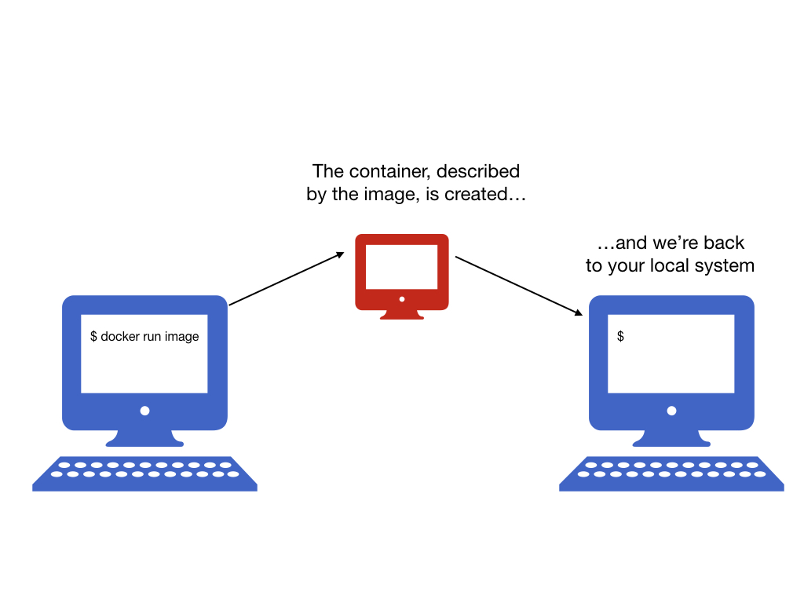
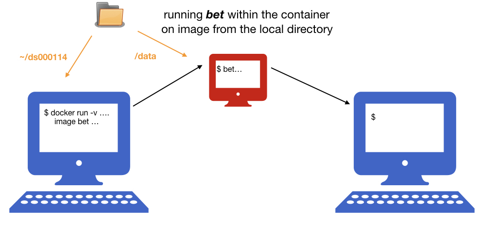
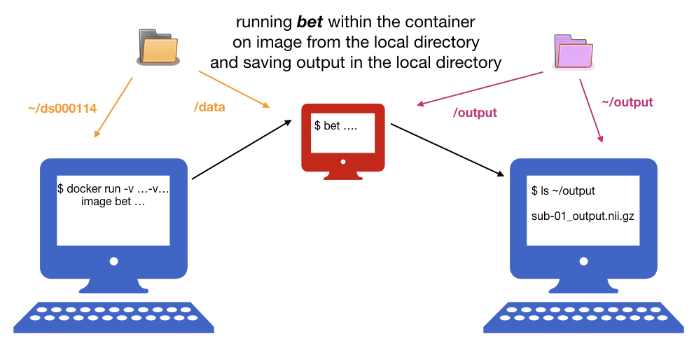
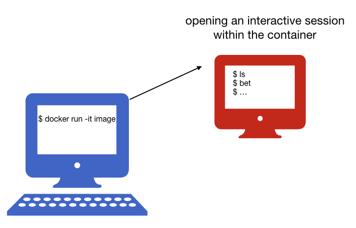

name: inverse
layout: true
class: center, middle, inverse
---
# Exercises

---
layout: false

- #### Exercise 1: Creating a Docker image with FSL
- #### Exercise 2: Running *bet* within the container

---

name: inverse
layout: true
class: center, middle, inverse
---
### Exercise 1: Creating a Docker image with FSL
---
layout: false

- #### In order to create a docker image we need to write a Dockerfile, that contains all the commands a user could call on the command line to assemble an image. Dockerfile provide a “recipe” for an image.

  - a simple Dockerfile might look like this

  ```bash
  FROM ubuntu:latest
  RUN apt-get update -y && apt-get install -y git emacs
  ```

---
layout: false
  - a more complicate Dockerfile with FSL and python might look like this 

  ```bash
  FROM neurodebian:stretch-non-free
  ARG DEBIAN_FRONTEND="noninteractive"

  ENV LANG="en_US.UTF-8" \
      LC_ALL="en_US.UTF-8" \
      ND_ENTRYPOINT="/neurodocker/startup.sh"
  RUN export ND_ENTRYPOINT="/neurodocker/startup.sh" \
      && apt-get update -qq \
      && apt-get install -y -q --no-install-recommends \
             apt-utils bzip2 ca-certificates \
             curl locales unzip \
      && apt-get clean \
      && rm -rf /var/lib/apt/lists/* /tmp/* /var/tmp/* \
      && sed -i -e 's/# en_US.UTF-8 UTF-8/en_US.UTF-8 UTF-8/' /etc/locale.gen \
      && dpkg-reconfigure --frontend=noninteractive locales \
      && update-locale LANG="en_US.UTF-8" \
      && chmod 777 /opt && chmod a+s /opt \
      && mkdir -p /neurodocker \
      && if [ ! -f "$ND_ENTRYPOINT" ]; then \
           echo '#!/usr/bin/env bash' >> "$ND_ENTRYPOINT" \
      &&   echo 'set -e' >> "$ND_ENTRYPOINT" \
      &&   echo 'if [ -n "$1" ]; then "$@"; else /usr/bin/env bash; fi' >> "$ND_ENTRYPOINT"; \
      fi \
      && chmod -R 777 /neurodocker && chmod a+s /neurodocker
  ENTRYPOINT ["/neurodocker/startup.sh"]
  RUN apt-get update -qq \
      && apt-get install -y -q --no-install-recommends \
             fsl-5.0-core \
             fsl-mni152-templates \
      && apt-get clean \
      && rm -rf /var/lib/apt/lists/* /tmp/* /var/tmp/*
  RUN sed -i '$isource /etc/fsl/5.0/fsl.sh' $ND_ENTRYPOINT

  ```

---
layout: false

### Neurodocker - generate custom images

&nbsp;

  - It supports Docker and Singularity.	

  - It supports many packages used in neuroimiging, 
including FSL, AFNI, ANTs, FreeSurfer, SPM12,  Python.

  - It can minimize existing containers.

&nbsp;
&nbsp;

  - Creating a Dockerfile that includes FSL from Neurodebian:

  ```bash 
  docker run --rm kaczmarj/neurodocker:master generate docker \
  --base neurodebian:stretch-non-free \
  --pkg-manager apt \
  --install fsl-5.0-core fsl-mni152-templates \
  --add-to-entrypoint "source /etc/fsl/5.0/fsl.sh"

  ```
---
layout: false

### Building a Docker image using Neurodocker

- creating a new empty directory

```bash
mkdir my_docker
cd my_docker
```

- creating a Dockerfile using Neurodocker:
```bash
docker run --rm kaczmarj/neurodocker:master generate docker \
--base neurodebian:stretch-non-free \
--pkg-manager apt \
--install fsl-5.0-core fsl-mni152-templates \
--add-to-entrypoint "source /etc/fsl/5.0/fsl.sh" > Dockerfile

```

- building a Docker image:

```bash
docker build -t my_fsl .

```

- checking available Docker images:

```bash
docker images
```

---
layout: false

### Exercise 1 with Singularity

#### Building a Singularity image using Neurodocker

- creating a Singularity file using Neurodocker:
```bash
docker run --rm kaczmarj/neurodocker:master generate singularity \
--base neurodebian:stretch-non-free \
--pkg-manager apt \
--install fsl-5.0-core fsl-mni152-templates \
--add-to-entrypoint "source /etc/fsl/5.0/fsl.sh" > Singularity_fsl

```

- building a Singularity image:

```bash
sudo singularity build my_fsl.simg Singularity_fsl

```

---
name: inverse
layout: true
class: center, middle, inverse
---
## Exercise 2: Running *bet* within the container
---
layout: false

- running container
```bash
docker run my_fsl
```
--



---
layout: false

- running command within the container
```bash
docker run image bet
```
--


---
layout: false

- installing a datalad repository and downloading one T1w file
```bash
datalad install -r ///workshops/nih-2017/ds000114
datalad get ds000114/sub-01/ses-test/anat/sub-01_ses-test_T1w.nii.gz
```

- mounting a local directory with data and running bet on the downloaded file: 
```bash
docker run -v ~/ds000114:/data image bet /data/sub-01/ses-test/anat/sub-01_ses-test_T1w.nii.gz sub-01_output
```
--
- checking the output
```bash
ls -l
```
--




---
layout: false

- creating a new directory for output
```bash
mkdir output
```

- mounting local directories with data and output, and running bet on the downloaded file:
```bash
docker run -v ~/ds000114:/data -v ~/output:/output image bet /data/sub-01/ses-test/anat/sub-01_ses-test_T1w.nii.gz /output/sub-01_output
```
--
- checking the output
```bash
ls -l output
```
--



---
layout: false

### Exercise 2 with Singularity

#### Running *bet* in the Singularity container

- home directory is automatically mounted, so we don't have to specify (`-B` can be used to add more mounting points) 
```bash
singularity run fsl.simg bet ~/ds000114/sub-01/ses-test/anat/sub-01_ses-test_T1w.nii.gz ~/output/sub-01_output_sing
```

- checking the output
```bash
ls -l ~/output
```


---
layout: false

- running an interactive session:
```bash
docker run -it image
```
--



--
- running an interactive shell with Singularity:
```bash
singularity shell image
```
  - it doesn't run automatically the file specified in `%runscript` or `ENTRYPOINT`.

---
layout: false

- checking running containers
```bash
docker ps
```

- checking all containers
```bash
docker ps -a
```

- removing a container
```bash
docker rm <container id>
```

- removing all containers that stopped running 
```bash
docker rm $(docker ps -a -q)
```

- **use `--rm` option to remove the container after it exits**, e.g.: 
```
docker run --rm  fsl ls
```
--
&nbsp; 

- checking a list of running Singularity images
```bash
singularity instance.list
```
