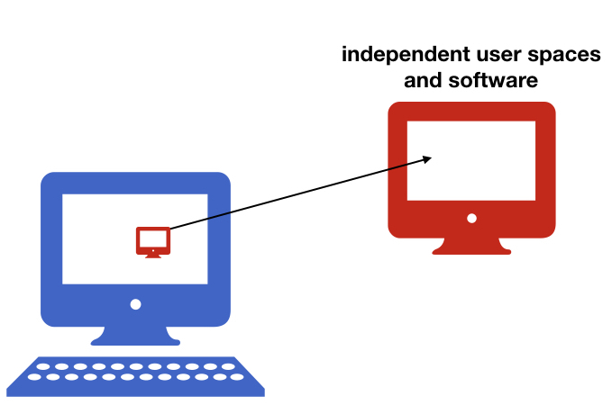

name: inverse
layout: true
class: center, middle, inverse
---
# Container based environments

---
name: inverse
layout: true
class: center, middle, inverse
---
## Introduction

---

layout: false

### What are the container technologies

&nbsp;

- #### Isolate the computing environments

&nbsp;

- #### Allow to encapsulate environments in a self-contained unit that can run anywhere

---

### Why do we need containers?

### Science Reproducibility

  - Each project in a lab depends on complex software environments
    - operating system
    - drivers
    - software dependencies: Python/MATLAB/R + libraries
&nbsp;

  - Containers:
    - allow to encapsulate your environment
    - you (and others!) can recreate the environment later in time

---
###  Why do we need containers?

### Collaboration with your colleagues

- Sharing your code or using a repository might not be enough
&nbsp;

- Containers:
  - encapsulate your environment
  - you can easily share the environment

---
###  Why do we need containers?

### Changing hardware

- The personal laptop might not be enough at some point
&nbsp;

- Containers:
  - encapsulate your environment
  - you can easily recreate the environment on a different machine

---

###Why do we need containers?

### Freedom to experiment!
- Universal Install Script from xkcd: *The failures usually don’t hurt anything...*
 And usually all your old programs work...

- Containers:
  - isolate the environments
  - you can do whatever you want and remove anytime

---
###  Why do we need containers?

### Using existing environments

- Installing all dependencies is not always easy.
&nbsp;

- Containers:
  - isolate and encapsulate the environments
  - there are many ready to use existing environments

---

### What does it mean to work in a container
If you are running a container on your laptop
- it uses the same hardware
- but user spaces and libraries are independent

--

---
### What does it mean to work in a container

If you are running a container on your laptop
- it uses the same hardware
- but user spaces and libraries are independent
- you can create additional bindings between these two environments

---

name: inverse
layout: true
class: center, middle, inverse
---
## Tools
---
layout: false

### Virtual Machines and Containers

- Two main types:

  - Virtual Machines:

      - Virtualbox
      - VMware
      - AWS, Google Compute Engine, ...

  - Containers:

      - Docker
      - Singularity
&nbsp;

--

- Main idea -- isolate the computing environment

  - Allow regenerating computing environments
  - Allow sharing your computing environments

---
### Virtual Machines vs Containers

--

 **Virtual Machines**
  - emulate whole computer system (software+hardware)
  - run on top of a physical machine using a *hypervisor*
  - use *hypervisor* to share and manage hardware of the host, and execute the guest operating system
  - guest machines are completely isolated and have dedicated resources
---
### Virtual Machines vs Containers

  

   **Docker containers**
  - share the host system’s kernel with other containers
  - each container gets its own isolated user space
  - only bins and libs are created from scratch
  - **containers are very lightweight and fast to start up**

---
### How  do we choose the technology

There is no one solution that always works, your choice should depend on:
- which hardware is available to you (also do you require GPU)
- where is your data stored
- Docker might me the most portable technology right now, but...
  - if you use HPC centers you will have to use Singularity instead.

---
###Docker and Singularity 
- **Docker:**
  - leading software container platform
  - an open-source project
  - it runs now on Mac OS X and Windows Pro (you don't have to install VM!)
  - can escalate privileges - not supported by HPC centers admins

--

- **Singularity:**
  - a container solution created for scientific application
  - supports existing and traditional HPC resources
  - a user inside a Singularity container is the same user as outside the container
(so you can be a root only if you were root on the host system)
  - VM needed on OSX and Windows
  - a Singularity image can be created from a Docker image

