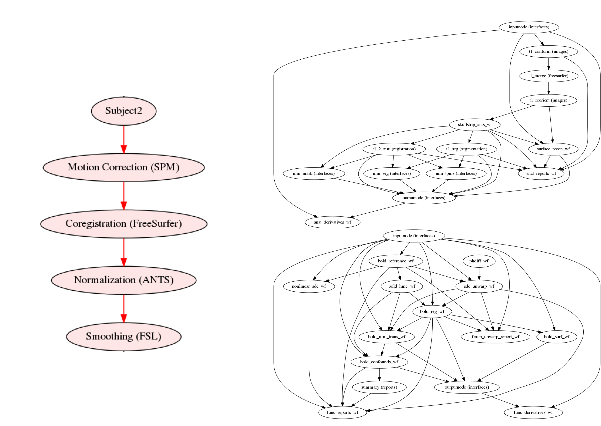

class: center middle inverse

# ReproFlow: Reusable scripts, environments, and their provenance
### satra@mit.edu  |  CC-BY
---
## Outline

### Executing computation
### Tracking computation
### Exercises

---

## Scripts and Dataflow Frameworks

- A script/workflow is a procedural abstraction

- There are many ways to process data:
    - GUIs (SPM, FSL GUIs)

    - Scripts (shell, Python, R, Matlab, etc.,.)

    - Dataflow frameworks (Nipype, AA, PSOM, etc.,.)

    - Containers
---

## Principles

- Separate computation from dataflow/data management

- Be modular

- Reuse over (re)create

- Standardize inputs and output (BIDS, NIDM Results)

- Be interoperable

- Encapsulation and isolation
---

## Example dataflows



---
class: center middle

## Scripts do not work by themselves

---
## Neuroimaging software (supported via Nipype)

afni ants

brainsuite

camino cmtk

dcm2nii diffusion_toolkit dipy dtitk

elastix

freesurfer fsl

minc mipav mne mrtrix

niftyfit nilearn nipy nitime

petpvc

slicer spm vista

workbench

---
## Environments and dependencies

- Virtual machines

- Amazon/Google Cloud images

- Neurodocker

---
class: center middle

## How to track all of this?

---

## Provenance

*What is provenance?*

PROV-DM is a W3C specification to express provenance records, which contain descriptions of the entities and activities involved in producing and delivering or otherwise influencing a given object.

<center></center>

---
class: middle center

Agent-centered provenance

Object-centered provenance

Process-centered provenance

---
## Why should we track

- Repeat analyses

- Reuse analyses on similar data

- Visualize analyses steps

- Find software used

- Query parameters of any step

- Review and verify  intent of each step

- Reuse part of analyses

- Discover related analyses

- Generate diffs between two analyses

- Determine impact of different parameters and environment on results

- Create searchable details

---
## What should we track?

--

data

environment

    - executables

    - libraries

    - operating system

    - hardware

actions

---
## Provenance: How to track?

0. Bash history/script

1. [Datalad](datalad.org)

2. [ReproZip](https://www.reprozip.org/)

---
class: middle center
## Exercise 1 - Run the FSL GLM workflow.

Michael will take over

---
## Exercise 2: Use ReproZip to rerun the workflow

Let's set things up to track with DataLad

```
# Now let's switch gears a little bit to record provenance slightly differently
datalad create reprozip
cd reprozip

# Let's get a new dataset
datalad install -d . -s $HOME/ds000114
```
---
## Run BET and track it

```
# and retrieve only the T1s from one participant
datalad get ds000114/sub-02/ses-*test/anat/sub-02_ses-*test_T1w.nii.gz

# Now we will use a tool called reprozip
datalad run singularity exec -B /tmp --bind $PWD/. -H $PWD/. \
 ~/images/fsl.simg \
 reprozip trace bet \
 ./ds000114/sub-02/ses-test/anat/sub-02_ses-test_T1w.nii.gz brain -m
```
--
We can then pack this:

```
datalad run singularity exec -B /tmp --bind $PWD/. -H $PWD/. \
 ~/images/fsl.simg reprozip pack
```
and look into it:
```
# and now let's look at the information stored
datalad run singularity exec -B /tmp --bind $PWD/. -H $PWD/. \
 ~/images/fsl.simg reprounzip info experiment.rpz

datalad run singularity exec -B /tmp --bind $PWD/. -H $PWD/. \
 ~/images/fsl.simg reprounzip showfiles experiment.rpz
```
---
## Now unpack and run this (in a new terminal)

```
source activate section3
cd reprozip/
```
--
Use reprounzip to unpack
```
reprounzip docker setup experiment.rpz repeat
```
--
Now rerun the analysis
```
cd repeat
reprounzip docker run
```
--
and clean up
```
reprounzip docker destroy repeat
```
---

## Exercise for later:
- Can you figure out how to capture data from FEAT?
